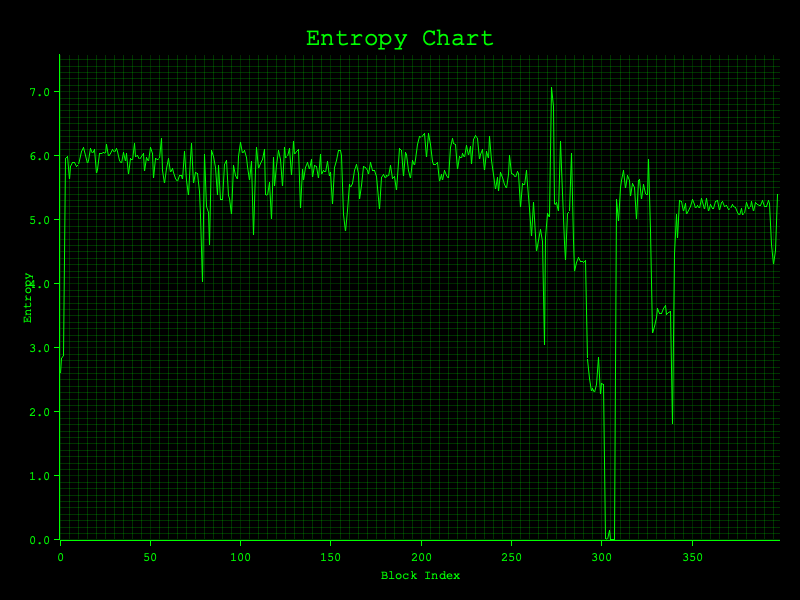

# Entroplot

`entroplot` is a Rust tool for analyzing and visualizing the entropy of files.  
It can be useful for reverse engineers, security researchers, and developers who want to understand the randomness or structure of binary data.



## Features

- Read any file and calculate its entropy
- Plot entropy values to help visualize patterns in binary data

## Installation

Clone the repository and build with Cargo:

```bash
git clone https://github.com/Piyush-Bhor/entroplot
cd entroplot
cargo build --release
```

The binary will be available in target/release/entroplot.

#### Usage

```bash
entroplot <file>
```

#### Example:

```bash
entroplot ./samples/malware.bin
```

This will create an graph showing the entropy of the file.
The graph will be saved as 'entropy_chart.png' in the current working directory.

You can specify the name and path of the output file by passing it to the binary like this:

```bash
entroplot ./samples/malware.bin --output-file /path/to/output.png

entroplot ./samples/malware.bin -o /path/to/output.png
```

You can see the 'help' using the `-h` or `--help` argument

```bash
entroplot -- --help

entroplot -- -h
```

```

Generate entropy plots

Usage: entroplot [OPTIONS] <INPUT_FILE>

Arguments:
  <INPUT_FILE>  The path to the input file whose entropy will be calculated

Options:
  -o, --output-file <OUTPUT_FILE>  The path where the generated entropy chart will be saved [default entropy_chart.png]
  -h, --help                       Print help
  -V, --version                    Print version

```

## Development

Run tests with:

```bash
cargo test
```

## Roadmap

1. Add interactive entropy visualization

2. Support for multiple file formats

3. Export results to JSON/CSV

   - More statistical measures beyond Shannon entropy

## Contributing

Contributions, bug reports, and feature requests are welcome!
Please open an issue or submit a pull request.
License
